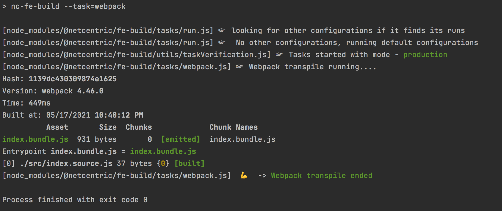

# @netcentric/fe-build

Frontend build tools for AEM projects.

[](https://npmjs.org/package/@netcentric/fe-build)
[](https://github.com/netcentric/fe-build/actions)
[](https://github.com/netcentric/fe-build/actions)
[](https://github.com/semantic-release/semantic-release)
[](https://opensource.org/licenses/Apache-2.0)

## Installation

```
npm i @netcentric/fe-build
```

## Usage
1.1. Add `nc-fe-build` task in package.json scripts
```
  "scripts": {
    "build": "nc-fe-build"
  },
```
1.2. Run npm task
```
npm run build
```
Output:



### JavaScript
1. Lint sourcecode with Eslint [TODO: links to: config | defaults]
2. Transpile with Babel [config | defaults]
3. Bundle and optimize with Webpack
4. Analyze bundles with webpack-bundle-analyzer

### CSS
1. Lint sourcecode with Stylelint [config]
2. Compile with node-sass [config]
3. Transform with Autoprefixer [config]

## Configuration file

Default configuration can be extended via `.febuild` file.
Config file is loaded and executed as JavaScript module.
Custom configuration is used for all files located in the same directory as `.febuild`
and in subdirectory tree.

Add `.febuild` whenever you need group of files to use separate build options.

Configuration that can be extended:
- general
- output
- resolve
- optimization
- plugins
- babel
- sass
- eslint
- stylelint
- postcss
- templates
- clientlibs

Eg, to override default babel config:
`.febuild`:
```
module.exports = {
    babel: {
        exclude: /node_modules\/(?!swiper|dom7)/,
        use: {
            options: {
                plugins: ['@babel/plugin-proposal-optional-chaining', '@babel/plugin-transform-runtime', '@babel/plugin-proposal-object-rest-spread']
            }
        }
    }
};
```

## Examples
// TODO
-  Add example projects
